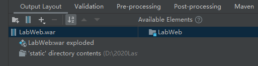

# LabWeb 部署注意事项

1. 打包

    打包需要有以下文件，之前的项目没有配置 WebRoot 目录，因此打包出现问题。

    

    这里我们配置 Directory Content 指向 static 文件夹，此时该文件夹就是 WebRoot 目录。

2. docker-compose

    我们使用 version 3 的语法编写 `docker-compose.yml`，因此服务器 docker 的版本应大于 19.0.0，docker-compose 的版本应大于 1.24.0，之前服务器这些应用的版本太低，需要离线更新（服务器只接校内网，无法访问外网，因此离线更新）

3. docker 镜像

    docker 容器需要使用 tomcat:10, mysql:latest 等镜像，因此需要离线下载这些镜像：在本地下载并打包后上传到服务器再解压：
    
    - 打包
    ```bash
    docker save -o tomcat-10.tar tomcat:10
    ```
    - 解压
    ```bash
    docker load -i tomcat-10.tar
    ```

4. tomcat 端口

    tomcat 默认启动端口是 8080，若想服务器 80 端口与 8080 端口映射，需要在 `docker-compose.yml` 文件中配置：

    ```yml
    # 映射容器80端口到本地8080端口
    ports:
      - "80:8080"
    ```

5. tomcat 域名根目录

    我们打包的 war 应用需要放在 tomcat 的 webapps 目录，因此webapps 就是域名根目录，此时我们需要访问 `http://<ip>/<war包名>` URL 才能访问网站，如果我们想直接 访问 `http://<ip>/` 访问网站，则必须修改域名根目录，**或者** 将 war 包名改成 `ROOT`（ tomcat 默认的根路径是 `ROOT` ）。
